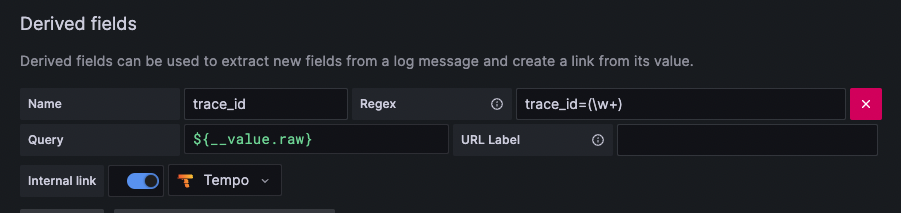
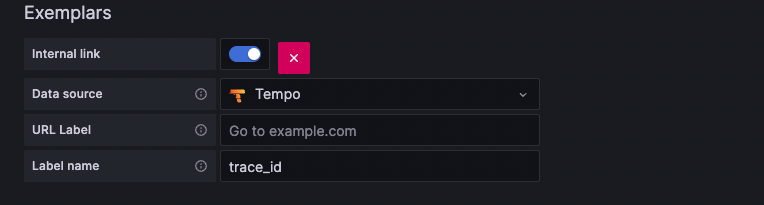

# 2023openinfradays_otel
- 본 페이지는 2023년도 OpenInfra Community Days Korea 2023에서 시연한 내용을 직접 구성해볼 수 있도록 준비한 자료입니다.  
- 구성에 대하여 문의는 이슈를 통해 주시면 최대한 답변드리겠습니다.

## Opentelemetry와  Grafana, prometheus 등을 활용한 대시보드 구성
   

- server, client 두 개의 서비스를 기동하여 서비스 간 통신을 그라파나 대시보드를 통해 모니터링/디버깅하는 예제를 구성해 볼 수 있습니다.
- 두 서버는 각각 opentelemetry instrument sdk를 javaagent에 설정하여 기동합니다.
- opentelemetry sdk(.jar)는 다음과 같은 역할을 수행합니다.
1. metric을 노출시켜 prometheus에서 scraping 가능하도록 합니다.
2. log 내에 trace_id를 보내줍니다.(java mdc - mapped diagnostic context 활용)
3. trace정보를 수집 가능한 서버로 전송합니다. 

### 00. 프로젝트 구성
| path  |  용도    |
|-------|---------|
| /client| client application 빌드용 |
| /server| server application 빌드용 |
| /grafana| 대시보드 템플릿 |
| /server| server application 빌드용 |
| /loki| loki helm chart value |
| /prometheus| prometheus helm chart value |
| /redis-stack-server| redis stack server 배포용 helm chart(official helm chart 없음) |

### 01. pre-req. 각주 참고하여 설치
- kubernetes[^kubernetes]   * [참고](/static/img_01.png)
- helm[^helm]
- java 17[^java]
- vs code[^vscode] or gradle[^gradle]

[^kubernetes]: [docker desktop 설치](https://docs.docker.com/desktop/install),  kubernetes 활성화 : 설정 -> kubernetes -> Enable Kubernetes    
[^helm]: [helm install](https://helm.sh/docs/intro/install/)   
[^java]: [temurin java](https://adoptium.net/temurin/releases/)   
[^vscode]: [vs code](https://code.visualstudio.com/download)   
[^gradle]: [gradle](https://gradle.org/install/)   

### 02. monitoring tool install
진행 시 로컬PC의 docker desktop과 kubernetes를 사용하므로 기동중이어야 함.

- [prometheus](https://github.com/prometheus-community/helm-charts)
- [grafana](https://github.com/grafana/helm-charts)
- [loki single replica](https://grafana.com/docs/loki/latest/installation/helm/install-monolithic/)
- [promtail](https://grafana.com/docs/loki/latest/clients/promtail/installation/)
- [tempo](https://grafana.com/docs/tempo/latest/setup/helm-chart/)

```bash
helm repo add prometheus-community https://prometheus-community.github.io/helm-charts
helm repo add grafana https://grafana.github.io/helm-charts

kubectl create namespace metric
helm upgrade -i prometheus prometheus-community/prometheus -f ./prometheus/values.yaml -n metric
helm upgrade -i  grafana grafana/grafana -n metric
helm upgrade -i  -f loki/values.yaml loki grafana/loki -n metric
helm upgrade -i  promtail grafana/protail -n metric
helm upgrade -i  -f tempo/values.yaml tempo grafana/tempo -n metric

```
> prometheus : cpu, memory 데이터 수집 + server_http_duration_bucket 과 exemplars 로 지연 api 확인 **metric 저장소**   
> promtail + loki : promtail이 로그를 수집(logstash 또는 fluentd 대체 가능), loki에 저장(elasticsearch 등 대체 가능) **log 저장소**   
> tempo : 분산추적을 위한 저장소. (zipkin&jaeger 등으로 대체 가능) **trace 저장소**   
> grafana : 위 세 종류의 telemetry를 조합하여 시각화.

### 03. application deploy

- [redis stack server](https://redis.io/docs/stack/get-started/install/docker/): database 역할.
- server, client application은 아래와 같이 커맨드라인으로 빌드하거나 vs code에서 gradle extension을 설치해서 빌드한다.
- vs code -> extension -> [gradle for java](https://marketplace.visualstudio.com/items?itemName=vscjava.vscode-gradle) 설치
- [jib 빌드](https://github.com/GoogleContainerTools/jib)는 링크를 참고

```bash 
helm upgrade -i redis-stack-server -f ./redis-stack-server/values.yaml ./redis-stack-server -n metric
cd server
(sudo) ./gradlew jibDockerBuild
kubectl apply -f ./kube.yaml
cd ../client
(sudo) ./gradlew jibDockerBuild
kubectl apply -f ./kube.yaml
```

### 04. application test

```bash
kubectl port-forward svc/spring-client-entrypoint 8080:8080 -n metric
```

another shell
```bash
curl localhost:8080/call # 전체 조회
curl "localhost:8080/call/one?name=redis" # 단건 조회. 응답 5초 지연
curl "localhost:8080/call/404" # client -> server 호출 시 오류 페이지 조회. client에서는 not found 리턴
```

### 05. grafana setting

```bash
# grafana admin password 확인
kubectl get secret --namespace metric grafana -o jsonpath="{.data.admin-password}" | base64 --decode ; echo 
# grafana 접속
kubectl port-forward svc/grafana 7777:80 -n metric
```

> http://localhost:7777 에 접속한다.   
> ID : admin / password : 위에서 확인   
> connections > data sources > Loki, Prometheus, Tempo를 각각 설정   

### 06. datasource configuration

- loki -> url(http://loki:3100)   
- Derived fields에 아래와 같이 입력   
   

- tempo -> url(http://tempo:3100)   

- prometheus -> url(http://prometheus-server)   
- Exemplars -> tempo 추가   
   

### 07. dashboard import
- grafana -> dashboards -> new -> import
- ./grafana/dashboard.json add