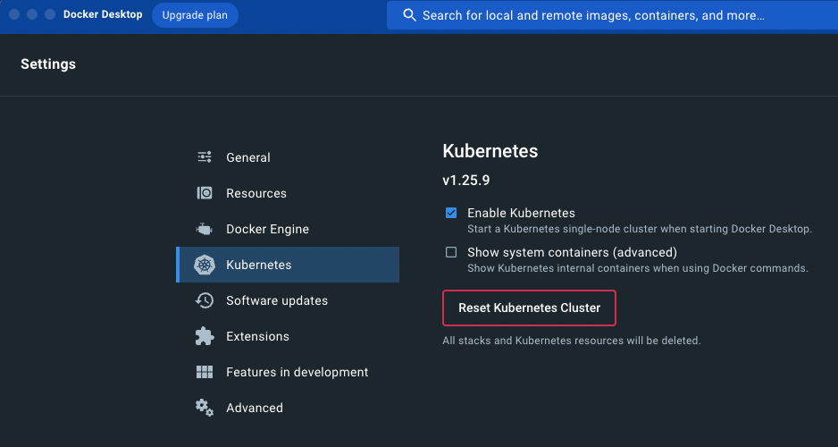

# 2023openinfradays_otel
- 본 페이지는 2023년도 OpenInfra Community Days Korea 2023에서 시연한 내용을 직접 구성해볼 수 있도록 준비한 자료입니다.
- 구성에 대하여 문의는 이슈를 통해 주시면 최대한 답변드리겠습니다.

## Opentelemetry와  Grafana, prometheus 등을 활용한 대시보드 구성
- 샘플은 다음과 같은 서비스를 예로 들고 있다.
- application은 총 2대로 spring client, spring server
- spring client에서 http로 spring server에 요청
- spring server는 redis에서 데이터를 읽어서 반환
- 정상 수신, 5초 지연 후 수신, 404 오류 세 종류의 api를 예제로 구성

### 프로젝트 구성
- /client # client application 빌드용
- /server # server application 빌드용

### 01. pre-req.
- kubernetes
- helm
#### kubernetes 환경 없을 시

-  [docker desktop 설치](https://docs.docker.com/desktop/install)
-  kubernetes 활성화 : 설정 -> kubernetes -> Enable Kubernetes


#### 이미지 빌드

- [java 17 설치]()
- [vs code](https://code.visualstudio.com/download)

### 02. monitoring tool install

- [prometheus](https://github.com/prometheus-community/helm-charts)
- [grafana](https://github.com/grafana/helm-charts)
- [loki single replica](https://grafana.com/docs/loki/latest/installation/helm/install-monolithic/)
- [promtail](https://grafana.com/docs/loki/latest/clients/promtail/installation/)
- [tempo](https://grafana.com/docs/tempo/latest/setup/helm-chart/)

```
helm repo add prometheus-community https://prometheus-community.github.io/helm-charts
helm repo add grafana https://grafana.github.io/helm-charts

kubectl create namespace metric
helm upgrade -i prometheus prometheus-community/prometheus -f ./prometheus/values.yaml -n metric
helm upgrade -i  grafana grafana/grafana -n metric
helm upgrade -i  -f loki/values.yaml loki grafana/loki -n metric
helm upgrade -i  promtail grafana/protail -n metric
helm upgrade -i  tempo grafana/tempo -n metric

```
> prometheus : cpu, memory 데이터 수집 + server_http_duration_bucket 과 exemplars 로 지연 api 확인 **metric 저장소**   
> promtail + loki : promtail이 로그를 수집(logstash 또는 fluentd 대체 가능), loki에 저장(elasticsearch 등 대체 가능) **log 저장소**   
> tempo : 분산추적을 위한 저장소. (zipkin&jaeger 등으로 대체 가능) **trace 저장소**   
> grafana : 위 세 종류의 telemetry를 조합하여 시각화.

### 03. application deploy

- [redis stack](https://redis.io/docs/stack/get-started/install/docker/)

```
helm upgrade -i redis-stack-server -f ./redis-stack-server/values.yaml ./redis-stack-server -n metric
cd server
(sudo) ./gradlew jibDockerBuild
kubectl apply -f ./kube.yaml
cd ../client
(sudo) ./gradlew jibDockerBuild
kubectl apply -f ./kube.yaml
```

> redis stack server: database 역할.

#### vs code -> extension -> [gradle for java](https://marketplace.visualstudio.com/items?itemName=vscjava.vscode-gradle) 설치
